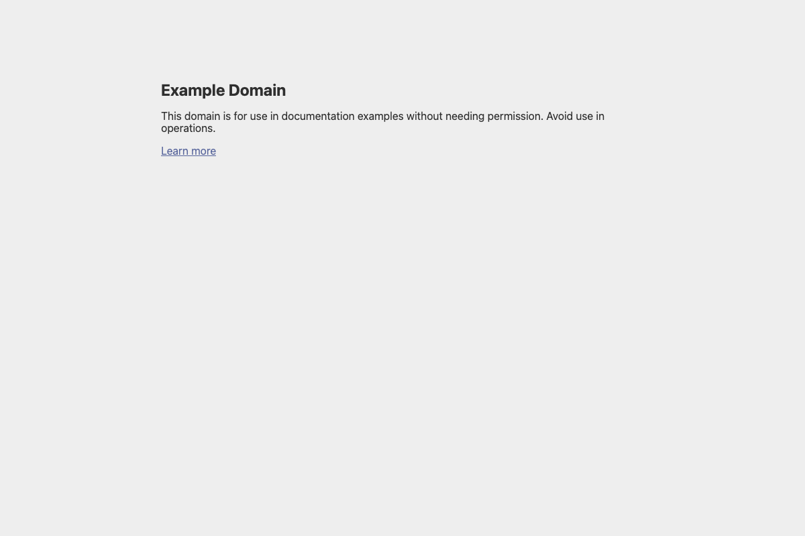
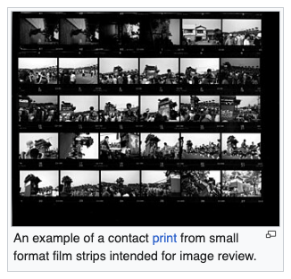
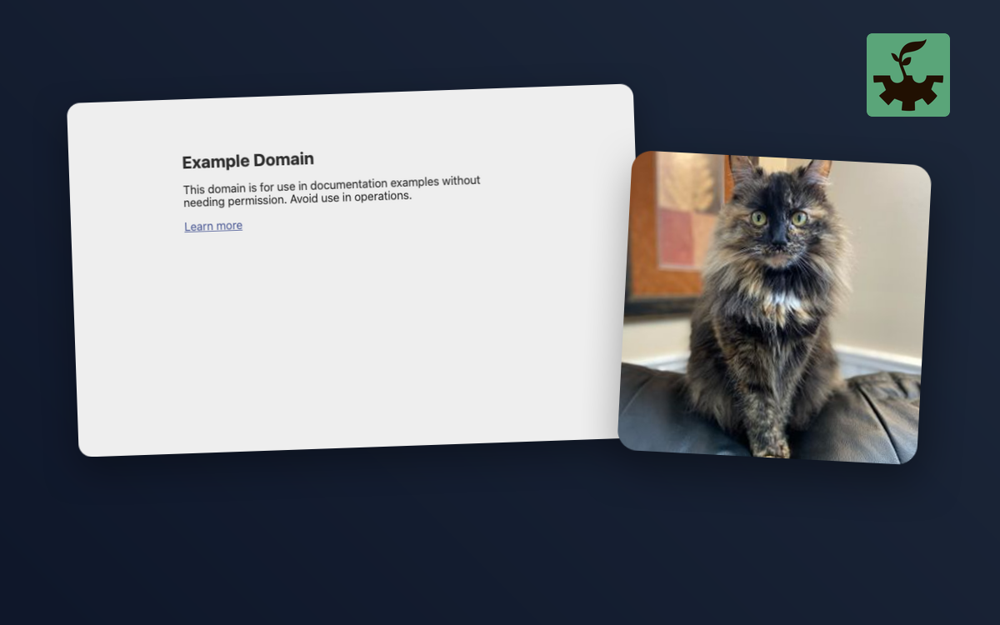

# Proofsheet Usage Guide

Proofsheet automates capturing crisp, repeatable screenshots from web applications and assembling them into polished graphic compositions.

This guide walks through Proofsheet's features progressively, from a minimal single-shot capture to multi-layer marketing compositions with remote and local images. Every example is backed by a standalone YAML file in the `examples/` directory and can be updated using `bundle exec rake usage`.

---

## Command-Line Interface (CLI)

Proofsheet provides a single CLI binary with three primary commands:

```sh
proofsheet capture [SHOT ...] [--config PATH] [--host HOST]
proofsheet compose [COMPOSITION ...] [--config PATH]
proofsheet list [--config PATH]
```

- **`capture`**: Launches headless Chrome, logs in (if configured), navigates to shot URLs, clips elements, and downloads remote images. If no shot or image names are specified, all configured shots and remote images are captured.
- **`compose`**: Combines captured shots and assets onto defined canvases using libvips. If no composition names are provided, all configured compositions are built.
- **`list`**: Prints configured shot names and paths without launching Chrome.
- **`--config PATH`** (`-c PATH`): Specifies the manifest configuration file (defaults to `proofsheet.yml`).
- **`--host HOST`**: Overrides the base URL specified in the manifest.

---

## 1. Simple Screenshot Capture

At its simplest, a Proofsheet manifest declares a `host` and a list of `shots`. Each shot must provide a `path` relative to `host`.

<!-- example: examples/01_simple.yml image: examples/output/homepage.png alt: "Example Domain Homepage" -->

```yaml
host: "https://example.com"

defaults:
  viewport: [1200, 800]
  output_dir: "examples/output"

shots:
  homepage:
    path: "/"
```



<!-- end-example -->

To run this capture:

```sh
proofsheet capture --config examples/01_simple.yml
```

This starts headless Chrome at the default viewport (`1200×800` as overridden under `defaults`), navigates to `https://example.com/`, waits for the page and web fonts to settle, and saves the full viewport to `examples/output/homepage.png`.

---

## 2. Dynamic Targets and Element Clipping

When capturing documentation or marketing assets, you frequently want to focus on a specific component or UI element rather than the entire browser viewport. Proofsheet allows clipping shots directly to CSS selectors with optional padding.

Additionally, URL paths can include dynamic variable placeholders using `%{variable_name}`, which Proofsheet interpolates from the `targets` block.

<!-- example: examples/02_targets_and_clipping.yml image: examples/output/contact_sheet_lead.png alt: "Contact Print Wikipedia Element" -->

```yaml
host: "https://en.wikipedia.org"

targets:
  article: "Contact_print"

defaults:
  viewport: [1440, 900]
  output_dir: "examples/output"

shots:
  contact_sheet_lead:
    path: "/wiki/%{article}"
    wait_for: "#firstHeading"
    clip:
      selector: "figure"
      padding: 8
```



<!-- end-example -->

Key options used here:
- **`targets`**: Defines key-value pairs interpolated into `path` templates (e.g. `/wiki/%{article}` becomes `/wiki/Contact_print`).
- **`wait_for`**: Halts capture until the selector (`#firstHeading`) is rendered in the DOM.
- **`clip`**:
  - `selector`: Computes the element's bounding box and crops the capture around it.
  - `padding`: Adds spacing (in pixels) around all four sides of the element.
  - `full_width`: (Optional, `true` or `false`) When `true`, expands the clip horizontally to fill the full viewport width while cropping vertically.

---

## 3. Authenticated Sessions & Safety Expectations

Many web applications require authentication before screenshots can be taken. Proofsheet automates the login sequence through headless Chrome and protects against taking screenshots of the wrong account or broken states.

The example below runs against an online Ruby on Rails demo ([Avo](https://main.avodemo.com)):

<!-- example: examples/03_authentication.yml image: examples/output/avo_dashboard.png alt: "Authenticated Admin Dashboard" -->

```yaml
host: "https://main.avodemo.com"

expect:
  username: "avo@cado.com"

credentials:
  username: "env:AVO_DEMO_USERNAME"
  password: "env:AVO_DEMO_PASSWORD"

login:
  path: "/users/sign_in"
  username_field: "user_email"
  password_field: "user_password"
  submit: "Sign in"
  expect:
    selector: "body"
    text: "Dashboards"

defaults:
  viewport: [1280, 800]
  output_dir: "examples/output"

shots:
  avo_dashboard:
    path: "/avo/dashboards/dashy"
    wait_for: "main"
    expect:
      selector: "body"
      text: "Dashy"
```


<!-- end-example -->

Security and verification mechanisms:
- **`credentials`**: Passwords and usernames are never written into the manifest. Instead, they reference environment variables (`env:VARIABLE_NAME`) or 1Password secrets (`op://vault/item/field`).
- **`expect.username`**: Verifies that the resolved username matches what the manifest author intended before Chrome ever boots.
- **`login`**: Instructs Proofsheet how to navigate to the sign-in page, fill in the credentials, and submit the form.
- **`expect`**: Assertions can be placed on the login form or on individual shots. If the specified `selector` does not contain the expected `text`, Proofsheet immediately aborts capture with an error instead of saving an invalid screenshot.

---

## 4. Fetching External Images

Compositions often require assets that Proofsheet did not directly photograph, such as partner marks, avatars, product photos, or brand logos. Proofsheet supports an `images:` section with three distinct sources:

1. **`url`**: Downloads an image directly over HTTP or HTTPS without starting Chrome (e.g., placeholder images or CDNs).
2. **`page` & `selector`**: Boots headless Chrome, visits `page`, locates the matching `` element, and fetches the browser-resolved `currentSrc` (useful when responsive `srcset` or dynamic JavaScript determines the actual image URL).
3. **`path`**: Points to a local file on disk, resolved relative to where `proofsheet` is executed. Local path images do not need to be captured.

<!-- example: examples/04_fetching_images.yml images: examples/output/cat_placeholder.png, examples/output/fascination_logo.png -->

```yaml
host: "https://example.com"

defaults:
  output_dir: "examples/output"

shots:
  sample_page:
    path: "/"

images:
  cat_placeholder:
    url: "https://placecats.com/300/200"

  fascination_logo:
    page: "https://fascination.works"
    selector: ".site-logo img"

  studio_logo:
    path: "examples/assets/logo480.png"
```


<!-- end-example -->

When running `proofsheet capture`, Proofsheet decodes the `url` and `page` images and writes them into the configured `output_dir` as real `<name>.png` files, retaining alpha transparency when the source has it.

---

## 5. Multi-Layer Graphic Compositions

Once screenshots and images are captured, Proofsheet's composer arranges them onto a fresh canvas using high-performance libvips image processing.

Layers can be layered, resized proportionally, given rounded corners, rotated, and cast soft gaussian drop shadows.

<!-- example: examples/05_compositions.yml image: examples/output/showcase.png alt: "Multi-Layer Showcase Composition" -->

```yaml
host: "https://example.com"

defaults:
  viewport: [800, 500]
  output_dir: "examples/output"

shots:
  web_page:
    path: "/"

images:
  cat_badge:
    url: "https://placecats.com/300/300"

  studio_logo:
    path: "examples/assets/logo480.png"

compositions:
  showcase:
    canvas: [1200, 750]
    background:
      gradient: ["#1e293b", "#0f172a"]
      angle: 135
    layers:
      - shot: web_page
        x: 80
        y: 100
        width: 680
        radius: 16
        rotate: -2
        shadow: true

      - image: cat_badge
        x: 740
        y: 180
        width: 360
        radius: 24
        rotate: 3
        shadow:
          x: 4
          y: 20
          blur: 28
          color: "#00000066"

      - image: studio_logo
        x: 1040
        y: 40
        width: 100
```



<!-- end-example -->

To build the composition:

```sh
# First ensure all source shots and remote images are captured:
proofsheet capture --config examples/05_compositions.yml

# Then generate the composition canvas:
proofsheet compose --config examples/05_compositions.yml
```

Composition highlights:
- **`canvas`**: Defines `[width, height]` in pixels.
- **`background`**:
  - Linear gradient: `gradient: ["#from", "#to"]` with an optional `angle:` in degrees.
  - Solid color: `background: "#1e293b"` (supports 6-digit hex `#RRGGBB` or 8-digit hex `#RRGGBBAA` for alpha).
  - Background image: `background: { image: "path/to/img.png" }` (automatically scaled and center-cropped to cover the canvas).
- **`layers`**:
  - `shot:` references a captured shot name; `image:` references an image name.
  - `x:` and `y:` coordinate positioning on the canvas.
  - `width:` scales the layer proportionally to the specified pixel width.
  - `radius:` rounds the layer's corners (clamped to half the smaller dimension).
  - `rotate:` rotates the layer by degrees (with transparent background padding).
  - `shadow: true`: applies a balanced drop shadow (`x: 0`, `y: 16`, `blur: 24`, `color: "#00000055"`). A custom mapping can override any of these parameters.
  - `crop:` (optional) crops a sub-region `[x, y, width, height]` of the source screenshot before resizing.

---

## Complete YAML Manifest Reference

The table below documents every configuration key available in Proofsheet manifests.

### Top-Level Configuration

| Key | Type | Required | Description |
|---|---|---|---|
| `host` | String | Yes (or via `--host`) | Base URL for the target application (e.g. `https://example.com`). |
| `shots` | Mapping | Yes | Definitions of screenshots to capture. Each entry maps a shot name to its settings. |
| `images` | Mapping | No | Definitions of external or local image assets. |
| `compositions` | Mapping | No | Definitions of multi-layer canvas compositions. |
| `defaults` | Mapping | No | Global capture settings (see [Defaults](#defaults)). |
| `targets` | Mapping | No | Key-value dictionary used for dynamic variable substitution (`%{key}`) in shot paths. |
| `credentials` | Mapping | If `login` is set | Credential resolution sources (see [Credentials](#credentials)). |
| `login` | Mapping | No | Automated authentication form configuration (see [Login](#login)). |
| `expect` | Mapping | No | Global safety checks (e.g. `username:` verification). |

---

### `defaults`

| Key | Type | Default | Description |
|---|---|---|---|
| `viewport` | `[width, height]` | `[1440, 900]` | Initial browser window and viewport dimensions in pixels. |
| `output_dir` | String | `"screenshots"` | Directory where captured screenshots, fetched images, and compositions are written. Resolved relative to working directory. |

---

### `credentials`

| Key | Type | Required | Description |
|---|---|---|---|
| `username` | String | Yes | Source for the username. Must be `env:VAR_NAME` or `op://vault/item/field`. |
| `password` | String | Yes | Source for the password. Must be `env:VAR_NAME` or `op://vault/item/field`. |
| `op_account` | String | No | Optional 1Password account shorthand or sign-in address passed to `op read --account`. |

---

### `login`

| Key | Type | Required | Description |
|---|---|---|---|
| `path` | String | Yes | Path to the sign-in page relative to `host` (e.g. `"/users/sign_in"`). |
| `username_field` | String | Yes | Field name, HTML ID, or label for the username input. |
| `password_field` | String | Yes | Field name, HTML ID, or label for the password input. |
| `submit` | String | Yes | Button text, value, or ID to click to submit the sign-in form. |
| `expect` | Mapping | No | Post-login verification: `{ selector: "...", text: "..." }`. Ensures login completed before proceeding. |

---

### `shots.<name>`

| Key | Type | Required | Description |
|---|---|---|---|
| `path` | String | Yes | Path to visit. May contain `%{target}` tokens. |
| `wait_for` | String | No | CSS selector that must appear on the page before capturing. |
| `click` | String | No | CSS selector of an element to click before taking the screenshot. |
| `clip` | Mapping | No | Crop the screenshot to an element bounding box (see [Clip](#clip)). |
| `expect` | Mapping | No | Verify text presence: `{ selector: "...", text: "..." }`. |
| `path_script` | String | No | JavaScript expression evaluated in the browser returning a relative path. Useful for dynamic URLs. |
| `resolved_wait_for` | String | No | Selector to wait for after navigating to the path returned by `path_script`. |

---

### `clip`

| Key | Type | Default | Description |
|---|---|---|---|
| `selector` | String | Required | CSS selector of the element to measure and clip to. |
| `padding` | Integer | `0` | Padding in pixels added around the element's bounding rect. |
| `full_width` | Boolean | `false` | When `true`, clips vertically to the element while spanning the full viewport width. |

---

### `images.<name>`

Each image entry must set **exactly one** of `path`, `url`, or `page`:

| Key | Type | Description |
|---|---|---|
| `path` | String | Path to a local image file on disk. No capture step needed. |
| `url` | String | HTTP or HTTPS URL to download directly. |
| `page` | String | Webpage URL to visit in headless Chrome. Requires `selector`. |
| `selector` | String | CSS selector matching an `` tag on `page`. Proofsheet reads its `currentSrc`. |

*Note: An image and a shot cannot share the same name because both write `<name>.png`.*

---

### `compositions.<name>`

| Key | Type | Required | Description |
|---|---|---|---|
| `canvas` | `[width, height]` | Yes | Canvas width and height in pixels. |
| `background` | String or Mapping | No (default: `"#ffffff"`) | Solid hex color (`"#ffffff"`), image mapping (`image: "path/to/bg.png"`), or gradient mapping (`gradient: ["#c1", "#c2"]`, `angle: 0..360`). |
| `layers` | Array of Mappings | Yes | List of layers drawn in order from back to front. |

---

### `compositions.<name>.layers[]`

Each layer must specify **exactly one** of `shot:` or `image:`:

| Key | Type | Default | Description |
|---|---|---|---|
| `shot` | String | - | Name of a captured shot to render. |
| `image` | String | - | Name of a configured image to render. |
| `x` | Integer | `0` | Horizontal coordinate on the canvas. |
| `y` | Integer | `0` | Vertical coordinate on the canvas. |
| `width` | Integer | Source width | Target display width in pixels. Height scales proportionally. |
| `radius` | Integer | `0` | Corner radius in pixels (applied after scaling). Clamped to half of the smaller dimension. |
| `rotate` | Integer / Float | `0` | Clockwise rotation angle in degrees. |
| `shadow` | Boolean or Mapping | `nil` | `true` for standard drop shadow, or `{ x: 0, y: 16, blur: 24, color: "#00000055" }`. |
| `crop` | Mapping | `nil` | Source cropping before scaling: `{ x: 0, y: 0, width: 800, height: 600 }`. |

---

## Updating Documentation

To re-run all examples and regenerate both the output images and markdown snippets:

```sh
bundle exec rake usage
```
